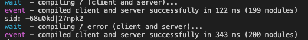

Plugin [effector-babel](https://effector.dev/docs/api/effector/babel-plugin/) generate two different sids when option [factories](https://effector.dev/docs/api/effector/babel-plugin/#factories) was enabled

For reproduce bug:

1. Run `yarn` and `yarn dev`
2. Open `localhost:3000`
3. Open web browser console
4. Reload page and compare SIDs logs in terminal and console.

### In terminal:

### In console:

